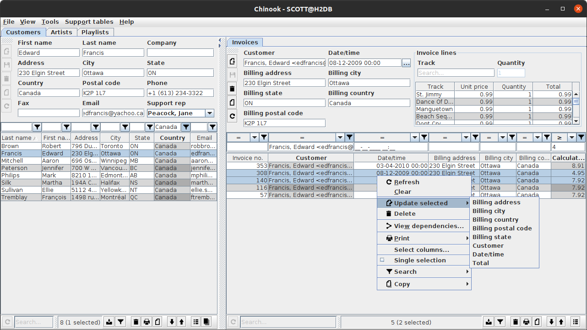
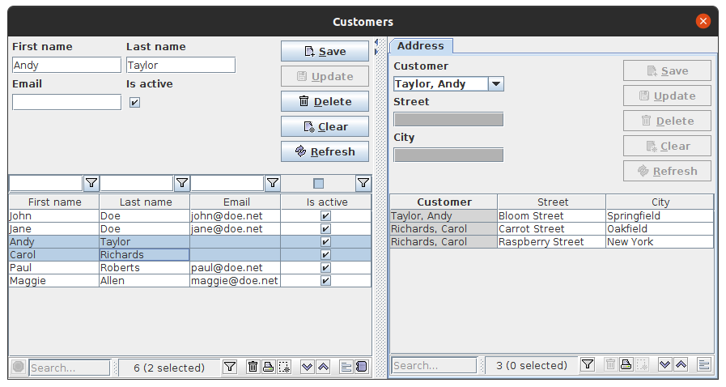

= Codion Application Framework

image::https://github.com/bjorndarri/codion/workflows/Java%20CI/badge.svg[CI]

== Introduction

Codion is a minimalistic full-stack Java rich client CRUD application framework based solely on https://en.wikipedia.org/wiki/Java_Platform,_Standard_Edition[Java Standard Edition] components.

Some highlights.

* Domain modelling in plain Java code (no XML, no annotations).
* Integrated JUnit testing of the domain model.
* A minimal but complete JDBC abstraction layer.
* Wiring together a rich Swing client based on the domain model is very straight forward.
* Clients use either a local JDBC connection or are served by a featherweight RMI/HTTP server.
* Integrated JasperReports support.
* Extremely rapid prototyping.
* Excellent replacement for legacy https://en.wikipedia.org/wiki/Oracle_Forms[Oracle Forms] applications.

== Motivation

I started developing Codion back in 2004, when the only Swing rich client CRUD framework available was practically unusable, and I was not about to abandon my good friend Swing in favor of my sworn enemy, HTML, which was fast becoming all the rage in the world of CRUD applications. I've been developing and using Codion professionally since 2004, always with the aim of eventually open sourcing it.

== License

Codion is dual-licensed under the Open Source https://en.wikipedia.org/wiki/Affero_General_Public_License[AGPLv3] license and a commercial license.

*Keep in mind that you can freely use the AGPL licensed version to create closed-source applications for personal or internal company use, since it only kicks in when the application is distributed*.

See http://www.gnu.org/licenses/gpl-faq.html#GPLRequireSourcePostedPublic[GPL FAQ]

== Open-source, not open-contribution

=== Pull requests

*For copyright and managament overhead reasons, pull requests and code contributions will not be accepted at this time*.

=== Bug reports

Bug reports are truly appreciated, please report bugs via https://github.com/bjorndarri/codion/issues[issues].

=== Discussions

Feel free to https://github.com/bjorndarri/codion/discussions[discuss] features, design, API and anything Codion related.

== Dependencies

Codion uses a limited set of third-party libraries, a Swing CRUD client with local JDBC and RMI connection capabilities pulls in the following dependencies:

* *https://www.json.org[org.json:json]* for persisting client preferences
* *https://github.com/kordamp/ikonli[org.kordamp.ikonli:ikonli-swing]* for application icon handling
* *https://github.com/Hakky54/sslcontext-kickstart[io.github.hakky54:sslcontext-kickstart]* for truststore handling
* *https://github.com/qos-ch/slf4j[org.slf4j:slf4j-api]* for your logging framework of choice
* *JDBC driver*
* *Logging framework*

A simple CRUD client pulls in ~15 Codion modules totalling ~1.5MB, so the combined weight of the Pet Clinic demo client for example is ~2MB (excluding the JDBC driver and logging framework).

== Rich Swing Client

Here is a screenshot of the Chinook demo client (included in the project), a rather typical Codion client.

Look & Feel provided by https://github.com/JFormDesigner/FlatLaf[Flat Look and Feel].

And here's a https://youtu.be/HeZocS89QkE[~1 min. video demonstrating some basic client functionality] (keep your music on, it's silent).

== Domain model

[cols="2,4"]
|===
|Module|Artifact
|is.codion.framework.domain|is.codion.jdk11:codion-framework-domain:{version}
|===

Codion is not an https://en.wikipedia.org/wiki/Object-relational_mapping[Object Relational Mapping] based framework, instead the domain model is based on concepts from entity relationship diagrams, *entities*, *attributes* and *properties*, eliminating most of the problems associated with https://en.wikipedia.org/wiki/Object-relational_impedance_mismatch[object-relational impedance mismatch].

An Entity represents a row in a table (or query), an Attribute identifies a column and its type, allowing for type safe access to the associated value, whereas a Property encapsulates the metadata required for the framework to present and persist the value.

In the following example we start by extending the *DefaultDomain* class. We define a *DomainType* constant identifying this domain model, use it to create *EntityType* constants for each entity and use those to create typed *Attribute* constants for each column. These constants are wrapped in an interface for a convenient namespace and are used whenever we need to refer to the entity type and its values. We then use the *entityTypes* and their respective *attributes* to define two entities, with a master/detail relationship, and add them to the domain model.

[source,java]
----
import static is.codion.framework.domain.DomainType.domainType;
import static is.codion.framework.domain.entity.EntityDefinition.definition;
import static is.codion.framework.domain.entity.KeyGenerator.identity;
import static is.codion.framework.domain.property.Property.*;

public class Store extends DefaultDomain {

  static final DomainType DOMAIN = domainType(Store.class);

  public interface Customer {
    EntityType TYPE = DOMAIN.entityType("store.customer");

    Attribute<Long> ID = TYPE.longAttribute("id");
    Attribute<String> FIRST_NAME = TYPE.stringAttribute("first_name");
    Attribute<String> LAST_NAME = TYPE.stringAttribute("last_name");
    Attribute<String> EMAIL = TYPE.stringAttribute("email");
    Attribute<Boolean> IS_ACTIVE = TYPE.booleanAttribute("is_active");
  }

  public interface Address {
    EntityType TYPE = DOMAIN.entityType("store.address");

    Attribute<Long> ID = TYPE.longAttribute("id");
    Attribute<Long> CUSTOMER_ID = TYPE.longAttribute("customer_id");
    Attribute<String> STREET = TYPE.stringAttribute("street");
    Attribute<String> CITY = TYPE.stringAttribute("city");

    ForeignKey CUSTOMER_FK = TYPE.foreignKey("customer_fk", CUSTOMER_ID, Customer.ID);
  }

  public Store() {
    super(DOMAIN);

    add(definition(
            primaryKeyProperty(Customer.ID),
            columnProperty(Customer.FIRST_NAME, "First name")
                    .nullable(false)
                    .maximumLength(40),
            columnProperty(Customer.LAST_NAME, "Last name")
                    .nullable(false)
                    .maximumLength(40),
            columnProperty(Customer.EMAIL, "Email")
                    .maximumLength(100),
            columnProperty(Customer.IS_ACTIVE, "Is active")
                    .nullable(false)
                    .defaultValue(true))
            .keyGenerator(identity())
            .stringFactory(StringFactory.builder()
                    .value(Customer.LAST_NAME)
                    .text(", ")
                    .value(Customer.FIRST_NAME)
                    .build())
            .caption("Customer"));

    add(definition(
            primaryKeyProperty(Address.ID),
            columnProperty(Address.CUSTOMER_ID)
                    .nullable(false),
            foreignKeyProperty(Address.CUSTOMER_FK, "Customer"),
            columnProperty(Address.STREET, "Street")
                    .nullable(false)
                    .maximumLength(100),
            columnProperty(Address.CITY, "City")
                    .nullable(false)
                    .maximumLength(50))
            .keyGenerator(identity())
            .stringFactory(StringFactory.builder()
                    .value(Address.STREET)
                    .text(", ")
                    .value(Address.CITY)
                    .build())
            .caption("Address"));
  }
}
----

=== Entity definition expanded

Here's one entity definition from above, pulled apart, with the ingredients visible.

.Display code
[%collapsible]
====
[source,java]
----
ColumnProperty.Builder<Long, ?> id =
      Property.primaryKeyProperty(Address.ID);

ColumnProperty.Builder<Long, ?> customerId =
      Property.columnProperty(Address.CUSTOMER_ID)
              .nullable(false);

ForeignKeyProperty.Builder customerFk =
      Property.foreignKeyProperty(Address.CUSTOMER_FK, "Customer");

ColumnProperty.Builder<String, ?> street =
      Property.columnProperty(Address.STREET, "Street")
              .nullable(false)
              .maximumLength(100);

ColumnProperty.Builder<String, ?> city =
      Property.columnProperty(Address.CITY, "City")
              .nullable(false)
              .maximumLength(50);

EntityDefinition.Builder address =
      EntityDefinition.definition(id, customerId, customerFk, street, city)
              .keyGenerator(KeyGenerator.identity())
              .stringFactory(StringFactory.builder()
                      .value(Address.STREET)
                      .text(", ")
                      .value(Address.CITY)
                      .build())
              .caption("Address");

add(address);
----
====

=== Using entities

An Entity instance maps Attributes to their respective values and keeps track of modifications, that is, values that have been modified since they were first set.

For persistance see <<Database access, Database access>> below.

[source,java]
----
//a domain model instance
Store store = new Store();

//a factory for Entity instances from this domain model
Entities entities = store.entities();

//instantiate and populate a new customer instance
Entity customer = entities.builder(Customer.TYPE)
        .with(Customer.FIRST_NAME, "John")
        .with(Customer.LAST_NAME, "Doe")
        .with(Customer.IS_ACTIVE, true)
        .build();

//retrieve values
String lastName = customer.get(Customer.LAST_NAME);
Boolean active = customer.get(Customer.IS_ACTIVE);

//modify values
customer.put(Customer.LAST_NAME, "Carter");

System.out.println(customer.isModified()); //true
System.out.println(customer.getOriginal(Customer.LAST_NAME)); //"Doe"

customer.put(Customer.LAST_NAME, "Doe");

System.out.println(customer.isModified()); //false
----

== Domain model test

[cols="2,4"]
|===
|Module|Artifact
|is.codion.framework.domain.test|is.codion.jdk11:codion-framework-domain-test:{version}
|===

The *EntityTestUnit* class provides a JUnit testing harness for the domain model. The *EntityTestUnit.test(entityType)* method runs insert, select, update and delete on a randomly generated entity instance, verifying the results.

[source,java]
----
public class StoreTest extends EntityTestUnit {

  public StoreTest() {
    super(Store.class.getName());
  }

  @Test
  void customer() throws Exception {
    test(Customer.TYPE);
  }

  @Test
  void address() throws Exception {
    test(Address.TYPE);
  }
}
----

== User interface

[cols="2,4"]
|===
|Module|Artifact
|is.codion.swing.framework.ui|is.codion.jdk11:codion-swing-framework-ui:{version}
|===

In the following example, we use the domain model from above and implement a *CustomerEditPanel* and *AddressEditPanel* by extending *EntityEditPanel*. These edit panels, as their names suggest, provide the UI for editing entity instances. In the *main* method we use these building blocks to assemble and display a client.

[source,java]
----
public class StoreDemo {

  private static class CustomerEditPanel extends EntityEditPanel {

    private CustomerEditPanel(SwingEntityEditModel editModel) {
      super(editModel);
    }

    @Override
    protected void initializeUI() {
      setInitialFocusAttribute(Customer.FIRST_NAME);
      createTextField(Customer.FIRST_NAME);
      createTextField(Customer.LAST_NAME);
      createTextField(Customer.EMAIL);
      createCheckBox(Customer.IS_ACTIVE);
      setLayout(gridLayout(4, 1));
      addInputPanel(Customer.FIRST_NAME);
      addInputPanel(Customer.LAST_NAME);
      addInputPanel(Customer.EMAIL);
      addInputPanel(Customer.IS_ACTIVE);
    }
  }

  private static class AddressEditPanel extends EntityEditPanel {

    private AddressEditPanel(SwingEntityEditModel addressEditModel) {
      super(addressEditModel);
    }

    @Override
    protected void initializeUI() {
      setInitialFocusAttribute(Address.STREET);
      createForeignKeyComboBox(Address.CUSTOMER_FK);
      createTextField(Address.STREET);
      createTextField(Address.CITY);
      setLayout(gridLayout(3, 1));
      addInputPanel(Address.CUSTOMER_FK);
      addInputPanel(Address.STREET);
      addInputPanel(Address.CITY);
    }
  }

  public static void main(String[] args) throws Exception {
    UIManager.setLookAndFeel(new FlatDarculaLaf());

    Database database = new H2DatabaseFactory()
            .createDatabase("jdbc:h2:mem:h2db",
                    "src/main/sql/create_schema_minimal.sql");

    EntityConnectionProvider connectionProvider =
            LocalEntityConnectionProvider.builder()
                    .database(database)
                    .domainClassName(Store.class.getName())
                    .user(User.parse("scott:tiger"))
                    .build();

    SwingEntityModel customerModel =
            new SwingEntityModel(Customer.TYPE, connectionProvider);
    SwingEntityModel addressModel =
            new SwingEntityModel(Address.TYPE, connectionProvider);
    customerModel.addDetailModel(addressModel);

    EntityPanel customerPanel =
            new EntityPanel(customerModel,
                    new CustomerEditPanel(customerModel.editModel()));
    EntityPanel addressPanel =
            new EntityPanel(addressModel,
                    new AddressEditPanel(addressModel.editModel()));
    customerPanel.addDetailPanel(addressPanel);

    customerPanel.tablePanel().table()
            .setAutoResizeMode(AUTO_RESIZE_ALL_COLUMNS);
    addressPanel.tablePanel().table()
            .setAutoResizeMode(AUTO_RESIZE_ALL_COLUMNS);
    addressPanel.tablePanel()
            .setConditionPanelVisible(true);

    customerModel.tableModel().refresh();
    customerPanel.initializePanel();

    Dialogs.componentDialog(customerPanel)
            .title("Customers")
            .onClosed(e -> connectionProvider.close())
            .show();
  }
}
----

...and the result, all in all around 150 lines of code.

Look & Feel provided by https://github.com/JFormDesigner/FlatLaf[Flat Look and Feel].

== Database access

[cols="2,4,2"]
|===
|Module|Artifact|Description
|is.codion.framework.db.core|is.codion.jdk11:codion-framework-db-core:{version}|Core
|is.codion.framework.db.local|is.codion.jdk11:codion-framework-db-local:{version}|JDBC
|is.codion.framework.db.rmi|is.codion.jdk11:codion-framework-db-rmi:{version}|RMI
|is.codion.framework.db.http|is.codion.jdk11:codion-framework-db-http:{version}|HTTP
|===

The *EntityConnection* interface defines the database layer. There are three implementations available; local, which is based on a direct JDBC connection (used below), RMI and HTTP which are both served by the Codion Server.

[source,java]
----
Database database = new H2DatabaseFactory()
        .createDatabase("jdbc:h2:mem:store",
                "src/main/sql/create_schema_minimal.sql");

EntityConnectionProvider connectionProvider =
        LocalEntityConnectionProvider.builder()
                .database(database)
                .domainClassName(Store.class.getName())
                .user(User.parse("scott:tiger"))
                .build();

EntityConnection connection = connectionProvider.connection();

List<Entity> customersNamedDoe =
        connection.select(Customer.LAST_NAME, "Doe");

List<Entity> doesAddresses =
        connection.select(Address.CUSTOMER_FK, customersNamedDoe);

List<Entity> customersWithoutEmail =
        connection.select(where(Customer.EMAIL).isNull());

List<String> activeCustomerEmailAddresses =
        connection.select(Customer.EMAIL,
                where(Customer.IS_ACTIVE).equalTo(true));

List<Entity> activeCustomersWithEmailAddresses =
        connection.select(where(Customer.IS_ACTIVE).equalTo(true)
                .and(where(Customer.EMAIL).isNotNull()));

//The domain model entities, a factory for Entity instances.
Entities entities = connection.entities();

Entity customer = entities.builder(Customer.TYPE)
        .with(Customer.FIRST_NAME, "Peter")
        .with(Customer.LAST_NAME, "Jackson")
        .build();

Key customerKey = connection.insert(customer);
//select to get generated and default column values
customer = connection.select(customerKey);

Entity address = entities.builder(Address.TYPE)
        .with(Address.CUSTOMER_FK, customer)
        .with(Address.STREET, "Elm st.")
        .with(Address.CITY, "Boston")
        .build();

Key addressKey = connection.insert(address);

customer.put(Customer.EMAIL, "mail@email.com");

customer = connection.update(customer);

connection.delete(asList(addressKey, customerKey));

connection.close();
----

Continue exploring on the link:https://codion.is[Codion Website].