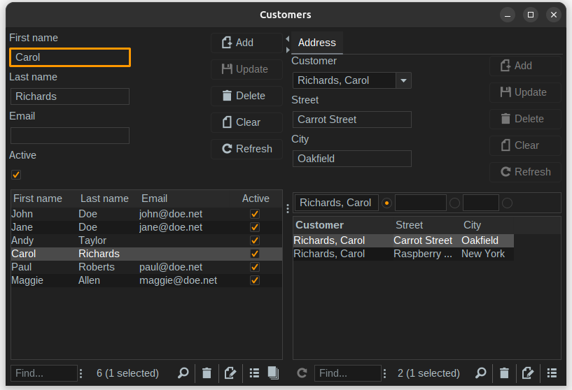

= Codion Application Framework
:dir-source: demos/manual/src/main/java
:dir-chinook-source: demos/chinook/src/main/java

image::documentation/src/docs/asciidoc/images/codion-logo.png[Codion logo,350]
image::https://github.com/bjorndarri/codion/workflows/Java%20CI/badge.svg[CI]

== Introduction

Codion is a minimalistic full-stack Java rich client CRUD application framework based solely on https://en.wikipedia.org/wiki/Java_Platform,_Standard_Edition[Java SE] components, it includes:

* Simple domain modelling in plain Java code.
* Integrated JUnit testing of the domain model.
* A minimal but complete JDBC abstraction layer.
* A straight forward and simple way of wiring together a rich Swing client on top of the domain model, all done in plain Java code.
* Clients use either a local JDBC connection or are served by a featherweight RMI/HTTP server.
* Integrated JasperReports support.
* ...and much more.

== Motivation

I started developing Codion back in 2004, when the only Swing rich client CRUD framework available was practically unusable, and I was not about to abandon my good friend Swing in favor of my sworn enemy, HTML, which was about to become all the rage in the world of CRUD applications. I've been developing and using Codion professionally for the last ~($currentYear - 2004) years, always with the aim of eventually open sourcing it.

== Rich Swing Client

Here's a screenshot of the Chinook demo client (included in the project), a rather typical Codion client. Nothing spectacular here, it's just a Swing client after all.

image::documentation/src/docs/asciidoc/images/chinook-client.png[Chinook client]

== Domain model
Codion is not an ORM framework, instead the domain model is based on concepts from entity relationship diagrams, *entities* and *properties*. You define the domain model in plain Java code, no annotations or XML is involved.

Here we start by extending the *Domain* class, with a few convenient static imports (skipping the rest of the imports for brevity). We then define string constants for the entities and their respective properties (referred to as *entityIds* and *propertyIds*), which are used whenever we need to refer to the entity type and its properties. And finally we use these *entityIds* and *propertyIds* to define two entities.

[source,java]
----
import static is.codion.framework.domain.entity.KeyGenerators.automatic;
import static is.codion.framework.domain.property.Properties.*;

public class Store extends Domain {

  public static final String T_CUSTOMER = "store.customer";
  public static final String CUSTOMER_ID = "id";
  public static final String CUSTOMER_FIRST_NAME = "first_name";
  public static final String CUSTOMER_LAST_NAME = "last_name";
  public static final String CUSTOMER_EMAIL = "email";
  public static final String CUSTOMER_IS_ACTIVE = "is_active";

  public static final String T_ADDRESS = "store.address";
  public static final String ADDRESS_ID = "id";
  public static final String ADDRESS_CUSTOMER_FK = "customer_fk";
  public static final String ADDRESS_CUSTOMER_ID = "customer_id";
  public static final String ADDRESS_STREET = "street";
  public static final String ADDRESS_CITY = "city";

  public Store() {
    define(T_CUSTOMER,
            primaryKeyProperty(CUSTOMER_ID, Types.INTEGER),
            columnProperty(CUSTOMER_FIRST_NAME, Types.VARCHAR, "First name")
                    .nullable(false).maximumLength(40),
            columnProperty(CUSTOMER_LAST_NAME, Types.VARCHAR, "Last name")
                    .nullable(false).maximumLength(40),
            columnProperty(CUSTOMER_EMAIL, Types.VARCHAR, "Email")
                    .maximumLength(100),
            columnProperty(CUSTOMER_IS_ACTIVE, Types.BOOLEAN, "Is active")
                    .defaultValue(true))
            .keyGenerator(automatic("store.customer"))
            .stringProvider(new StringProvider(CUSTOMER_LAST_NAME)
                    .addText(", ").addValue(CUSTOMER_FIRST_NAME))
            .caption("Customer");

    define(T_ADDRESS,
            primaryKeyProperty(ADDRESS_ID, Types.INTEGER),
            foreignKeyProperty(ADDRESS_CUSTOMER_FK, "Customer", T_CUSTOMER,
                    columnProperty(ADDRESS_CUSTOMER_ID))
                    .nullable(false),
            columnProperty(ADDRESS_STREET, Types.VARCHAR, "Street")
                    .nullable(false).maximumLength(100),
            columnProperty(ADDRESS_CITY, Types.VARCHAR, "City")
                    .nullable(false).maximumLength(50))
            .keyGenerator(automatic("store.address"))
            .stringProvider(new StringProvider(ADDRESS_STREET)
                    .addText(", ").addValue(ADDRESS_CITY))
            .caption("Address");
  }
}
----

The *EntityTestUnit* class provides an integrated JUnit testing harness for the domain model. The *EntityTestUnit.test(entityId)* method runs insert, select, update and delete on a randomly generated entity instance, verifying the results.

[source,java]
----
public class StoreTest extends EntityTestUnit {

  public StoreTest() {
    super(Store.class.getName());
  }

  @Test
  void customer() throws Exception {
    test(Store.T_CUSTOMER);
  }

  @Test
  void address() throws Exception {
    test(Store.T_ADDRESS);
  }
}
----

== User interface

In this tiny example we create a *CustomerPanel* by extending *EntityPanel* and a *CustomerEditPanel* and *AddressEditPanel* by extending *EntityEditPanel*. The edit panel, as the name suggests, provides the UI for editing entity instances. In the *main* method we use these building blocks to assemble and display a client.

[source,java]
----
public class CustomerPanel extends EntityPanel {

  private CustomerPanel(SwingEntityModel customerModel) {
    super(customerModel, new CustomerEditPanel(customerModel.getEditModel()));
  }

  private static class CustomerEditPanel extends EntityEditPanel {

    private CustomerEditPanel(SwingEntityEditModel editModel) {
      super(editModel);
    }

    @Override
    protected void initializeUI() {
      setInitialFocusProperty(CUSTOMER_FIRST_NAME);
      createTextField(CUSTOMER_FIRST_NAME).setColumns(12);
      createTextField(CUSTOMER_LAST_NAME).setColumns(12);
      createTextField(CUSTOMER_EMAIL).setColumns(12);
      createCheckBox(CUSTOMER_IS_ACTIVE, null, IncludeCaption.NO);
      setLayout(gridLayout(2, 2));
      addPropertyPanel(CUSTOMER_FIRST_NAME);
      addPropertyPanel(CUSTOMER_LAST_NAME);
      addPropertyPanel(CUSTOMER_EMAIL);
      addPropertyPanel(CUSTOMER_IS_ACTIVE);
    }
  }

  private static class AddressEditPanel extends EntityEditPanel {

    private AddressEditPanel(SwingEntityEditModel addressEditModel) {
      super(addressEditModel);
    }

    @Override
    protected void initializeUI() {
      setInitialFocusProperty(ADDRESS_STREET);
      createForeignKeyComboBox(ADDRESS_CUSTOMER_FK);
      createTextField(ADDRESS_STREET).setColumns(12);
      createTextField(ADDRESS_CITY).setColumns(12);
      setLayout(gridLayout(3, 1));
      addPropertyPanel(ADDRESS_CUSTOMER_FK);
      addPropertyPanel(ADDRESS_STREET);
      addPropertyPanel(ADDRESS_CITY);
    }
  }

  public static void main(String[] args) {
    Database database = new H2DatabaseProvider()
            .createDatabase("jdbc:h2:mem:h2db",
                    "src/main/sql/create_schema_minimal.sql");

    EntityConnectionProvider connectionProvider =
            new LocalEntityConnectionProvider(database)
                    .setDomainClassName(Store.class.getName())
                    .setUser(Users.parseUser("scott:tiger"));

    SwingEntityModel customerModel =
            new SwingEntityModel(T_CUSTOMER, connectionProvider);
    SwingEntityModel addressModel =
            new SwingEntityModel(T_ADDRESS, connectionProvider);
    customerModel.addDetailModel(addressModel);

    EntityPanel customerPanel =
            new CustomerPanel(customerModel);
    EntityPanel addressPanel =
            new EntityPanel(addressModel,
                    new AddressEditPanel(addressModel.getEditModel()));
    customerPanel.addDetailPanel(addressPanel);

    customerPanel.getTablePanel().setConditionPanelVisible(true);
    customerPanel.getTablePanel().getTable().setAutoResizeMode(AUTO_RESIZE_ALL_COLUMNS);
    addressPanel.getTablePanel().getTable().setAutoResizeMode(AUTO_RESIZE_ALL_COLUMNS);

    customerModel.refresh();
    customerPanel.initializePanel();

    Dialogs.displayInDialog(null, customerPanel, "Customers");

    connectionProvider.disconnect();
  }
}
----

...and the result, all in all around 150 lines of code.

== Database access

The *EntityConnection* interface defines the database layer. There are three implementations available; local, which is based on a direct JDBC connection (used below), RMI and HTTP which are both served by the Codion EntityServer.

[source,java]
----
Database database = new H2DatabaseProvider()
        .createDatabase("jdbc:h2:mem:store",
                "src/main/sql/create_schema_minimal.sql");

EntityConnectionProvider connectionProvider =
        new LocalEntityConnectionProvider(database)
                .setDomainClassName(Store.class.getName())
                .setUser(Users.parseUser("scott:tiger"));

EntityConnection connection = connectionProvider.getConnection();

List<Entity> customersNamedDoe =
        connection.select(T_CUSTOMER, CUSTOMER_LAST_NAME, "Doe");

List<Entity> doesAddresses =
        connection.select(T_ADDRESS, ADDRESS_CUSTOMER_FK, customersNamedDoe);

List<Entity> customersWithoutEmail =
        connection.select(selectCondition(T_CUSTOMER, CUSTOMER_EMAIL, Operator.LIKE, null));

//The domain model entities, a factory for Entity instances.
Entities entities = connection.getEntities();

Entity customer = entities.entity(T_CUSTOMER);
customer.put(CUSTOMER_FIRST_NAME, "Björn");
customer.put(CUSTOMER_LAST_NAME, "Sigurðsson");
customer.put(CUSTOMER_IS_ACTIVE, true);

Entity.Key customerKey = connection.insert(customer);
//select to get generated and default column values
customer = connection.selectSingle(customerKey);

Entity address = entities.entity(T_ADDRESS);
address.put(ADDRESS_CUSTOMER_FK, customer);
address.put(ADDRESS_STREET, "Stóragerði");
address.put(ADDRESS_CITY, "Reykjavík");

Entity.Key addressKey = connection.insert(address);

customer.put(CUSTOMER_EMAIL, "valid@email.is");

customer = connection.update(customer);

connection.delete(asList(addressKey, customerKey));

connection.disconnect();
----

Continue reading on the link:https://codion.is[Codion Web Site].