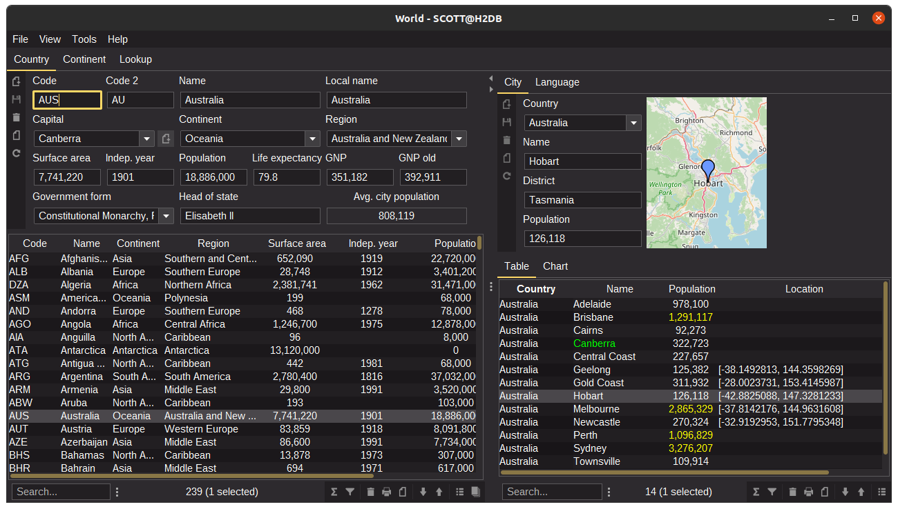

= Codion Application Framework
:version: 0.17.16
:url-help: https://codion.is/doc/{version}/help
:url-manual: https://codion.is/doc/{version}/manual
:url-technical: https://codion.is/doc/{version}/technical

image::documentation/src/docs/asciidoc/images/codion-logo.png[Codion logo,350]

image:https://github.com/codion-is/codion/workflows/Java%20CI/badge.svg[CI]
image:https://img.shields.io/badge/License-GNU%20GPL-blue[link="https://www.gnu.org/licenses/gpl-3.0.en.html"]
image:https://img.shields.io/badge/JDK_Compatibility-17+-blue.svg[Java Compatability 17+]
image:https://img.shields.io/badge/chat-Github%20discussions-blue[link="https://github.com/codion-is/codion/discussions"]

== Introduction

Codion is a full-stack, Java rich client desktop CRUD application framework, based solely on https://en.wikipedia.org/wiki/Java_Platform,_Standard_Edition[Java Standard Edition] components.

* <<Domain model, Domain modelling>> in plain Java code without annotations.
* Integrated https://github.com/junit-team/junit5[JUnit] testing of the domain model.
* A minimal but complete {url-manual}/manual.html#_entityconnection[JDBC abstraction layer].
* <<User interface, Assembling a Swing UI>> based on the domain model is very straight forward.
* Swing client provides:
** A {url-help}/client.html#_keyboard_shortcuts[practically mouse free] user experience.
** Extensive {url-help}/client.html#_searching[searching] capabilities.
* Clients use either a local JDBC connection or are served by a {url-technical}/technical.html#_server[featherweight RMI/HTTP server].
* {url-manual}/manual.html#_reporting_with_jasperreports[Integrated] https://github.com/TIBCOSoftware/jasperreports[JasperReports] support.
* Extremely rapid prototyping.

== Motivation

My main motivation for developing Codion back in 2004 was the lack of application frameworks based on Java Standard Edition. I was writing rather basic desktop CRUD appliations, so I wanted to stick with Standard Edition components, Swing, JDBC and RMI.

I figured a CRUD application framework should:

* Embody Alan Kay’s adage "simple things should be simple, complex things should be possible".
* Provide a reasonable set of application functionality out of the box.
* Have a clear separation between model and UI for easy unit testing.
* Limit accidental complexity and be intuitive and enjoyable to use.

== Dependencies

The core Codion framework components use a limited set of third-party libraries, a Swing client with local JDBC and RMI connection capabilities pulls in the following dependencies:

* *https://www.json.org[org.json:json]* for persisting application preferences
* *https://github.com/kordamp/ikonli[org.kordamp.ikonli:ikonli-swing]* for application icon handling
* *https://github.com/Hakky54/sslcontext-kickstart[io.github.hakky54:sslcontext-kickstart]* for RMI truststore handling
* *https://github.com/qos-ch/slf4j[org.slf4j:slf4j-api]* for your logging framework of choice
* *JDBC driver*
* *Logging framework*

A basic CRUD client pulls in ~15 Codion modules totalling ~1.7MB, so the combined size of the Petclinic demo client for example, with local connection capabilities, is ~5MB.

== Demo application projects

The following applications can be found in the *demos* folder of the Codion project, but are also available in separate Git repositories as fully configured stand-alone Gradle projects.

All these projects contain jlink/jpackage configurations for packaging the application, server, server monitor and load-test, if applicable.

Look & Feel provided by https://github.com/JFormDesigner/FlatLaf[Flat Look and Feel].

=== https://github.com/codion-is/petclinic[Petclinic]

Minimalistic bare-bones project, with a local JDBC connection option. A good place to start.

image::documentation/src/docs/asciidoc/images/tutorials/petclinic/owners.png[Petclinic client]

=== https://github.com/codion-is/world[World]

Fully configured multi-module project, with separate client modules configured for JDBC, RMI and HTTP connection options.

Includes server and server monitor modules and jlink/jpackage configurations.

=== https://github.com/codion-is/chinook[Chinook]

Fully configured multi-module project, with separate client modules configured for JDBC, RMI and HTTP connection options.

Includes load-test, server, and server monitor modules and jlink/jpackage configurations.

image::documentation/src/docs/asciidoc/images/chinook-client.png[Chinook client]

== Domain model

[cols="2,4"]
|===
|Module|Artifact
|is.codion.framework.domain|is.codion:codion-framework-domain:{version}
|===

Codion is not an https://en.wikipedia.org/wiki/Object-relational_mapping[Object Relational Mapping] based framework, instead the domain model is based on concepts from entity relationship diagrams, *entities*, *attributes*, *columns* and *foreign keys*, eliminating most of the problems associated with https://en.wikipedia.org/wiki/Object-relational_impedance_mismatch[object-relational impedance mismatch].

=== Entities

The Codion framework is based around the *Entity* class which represents a row in a table or query. An *Entity* maps *Attributes* to their respective values and keeps track of values that have been modified since they were first set.

[source,java]
----
// the domain model instance
Store store = new Store();

// a factory for Entity instances from this domain model
Entities entities = store.entities();

// instantiate and populate a new customer instance
Entity customer = entities.builder(Customer.TYPE)
        .with(Customer.FIRST_NAME, "John")
        .with(Customer.LAST_NAME, "Doe")
        .with(Customer.IS_ACTIVE, true)
        .build();

// retrieve values
String lastName = customer.get(Customer.LAST_NAME);
Boolean active = customer.get(Customer.IS_ACTIVE);

// modify values
customer.put(Customer.LAST_NAME, "Carter");

System.out.println(customer.isModified()); //true
System.out.println(customer.original(Customer.LAST_NAME)); //"Doe"

// revert changes
customer.put(Customer.LAST_NAME, "Doe");

System.out.println(customer.isModified()); //false
----

For persistance see <<Database access, Database access>> below.

=== Defining entities

*EntityType* represents a table (or query), *Attribute* represents a typed value identifier, usually appearing as one of its subclasses *Column* or *ForeignKey*. The metadata required to present and persist entities is encapsulated by *EntityDefinition* and *AttributeDefinition*.

In the below example, we define a domain model with two entities, *Customer* and *Address*, with a master/detail retionship, using the following steps:

. Extend the *DefaultDomain* class and create a *DomainType* constant identifying the domain model.
. Create a namespace interface for each *Entity* and use the *DomainType* to create *EntityType* constants.
. Use the *EntityType* constant to create *Column* constants for each column and a *ForeignKey* constant for the foreign key relationship.

NOTE:: The constants defined in the above steps represent the domain API and are usually all you need to work with the domain entities.

. Use the *EntityType* constants to define each entity, based on attributes defined using the *Column* and *ForeignKey* constants, and add the entity definitions to the domain model.

[source,java]
----
import static is.codion.framework.domain.DomainType.domainType;
import static is.codion.framework.domain.entity.KeyGenerator.identity;

// Extend the DefaultDomain class.
public class Store extends DefaultDomain {

  // Create a DomainType constant identifying the domain model.
  public static final DomainType DOMAIN = domainType(Store.class);

  // Create a namespace interface for the Customer entity.
  public interface Customer {
    // Use the DomainType and the table name to create an
    // EntityType constant identifying the entity.
    EntityType TYPE = DOMAIN.entityType("store.customer");

    // Use the EntityType to create typed Column constants for each column.
    Column<Long> ID = TYPE.longColumn("id");
    Column<String> FIRST_NAME = TYPE.stringColumn("first_name");
    Column<String> LAST_NAME = TYPE.stringColumn("last_name");
    Column<String> EMAIL = TYPE.stringColumn("email");
    Column<Boolean> IS_ACTIVE = TYPE.booleanColumn("is_active");
  }

  // Create a namespace interface for the Address entity.
  public interface Address {
    EntityType TYPE = DOMAIN.entityType("store.address");

    Column<Long> ID = TYPE.longColumn("id");
    Column<Long> CUSTOMER_ID = TYPE.longColumn("customer_id");
    Column<String> STREET = TYPE.stringColumn("street");
    Column<String> CITY = TYPE.stringColumn("city");

    // Use the EntityType to create a ForeignKey
    // constant for the foreign key relationship.
    ForeignKey CUSTOMER_FK = TYPE.foreignKey("customer_fk", CUSTOMER_ID, Customer.ID);
  }

  public Store() {
    super(DOMAIN);
    // Use the Customer.TYPE constant to define a new entity,
    // based on attributes defined using the Column constants.
    // This entity definition is then added to the domain model.
    add(Customer.TYPE.define(           // returns EntityDefinition.Builder
            Customer.ID.define()
                    .primaryKey(),      // returns ColumnDefinition.Builder
            Customer.FIRST_NAME.define()
                    .column()           // returns ColumnDefinition.Builder
                    .caption("First name")
                    .nullable(false)
                    .maximumLength(40),
            Customer.LAST_NAME.define()
                    .column()
                    .caption("Last name")
                    .nullable(false)
                    .maximumLength(40),
            Customer.EMAIL.define()
                    .column()
                    .caption("Email")
                    .maximumLength(100),
            Customer.IS_ACTIVE.define()
                    .column()
                    .caption("Is active")
                    .nullable(false)
                    .defaultValue(true))
            .keyGenerator(identity())
            .stringFactory(StringFactory.builder()
                    .value(Customer.LAST_NAME)
                    .text(", ")
                    .value(Customer.FIRST_NAME)
                    .build())
            .caption("Customer"));

    // Use the Address.TYPE constant to define a new entity,
    // based on attributes defined using the Column and ForeignKey constants.
    // This entity definition is then added to the domain model.
    add(Address.TYPE.define(
            Address.ID.define()
                    .primaryKey(),
            Address.CUSTOMER_ID.define()
                    .column()
                    .nullable(false),
            Address.CUSTOMER_FK.define()
                    .foreignKey()       // returns ForeignKeyDefinition.Builder
                    .caption("Customer"),
            Address.STREET.define()
                    .column()
                    .caption("Street")
                    .nullable(false)
                    .maximumLength(100),
            Address.CITY.define()
                    .column()
                    .caption("City")
                    .nullable(false)
                    .maximumLength(50))
            .keyGenerator(identity())
            .stringFactory(StringFactory.builder()
                    .value(Address.STREET)
                    .text(", ")
                    .value(Address.CITY)
                    .build())
            .caption("Address"));
  }
}
----

NOTE: {url-technical}/technical.html#_live_templates[IntelliJ IDEA live templates] for working with domain models.

=== Entity definition expanded

Here's one entity definition from above, pulled apart, with the ingredients exposed.

.Display code
[%collapsible]
====
[source,java]
----
ColumnDefinition.Builder<Long, ?> id =
        Address.ID.define()
                .primaryKey();

ColumnDefinition.Builder<Long, ?> customerId =
        Address.CUSTOMER_ID.define()
                .column()
                .nullable(false);

ForeignKeyDefinition.Builder customerFk =
        Address.CUSTOMER_FK.define()
                .foreignKey()
                .caption("Customer");

ColumnDefinition.Builder<String, ?> street =
        Address.STREET.define()
                .column()
                .caption("Street")
                .nullable(false)
                .maximumLength(100);

ColumnDefinition.Builder<String, ?> city =
        Address.CITY.define()
                .column()
                .caption("City")
                .nullable(false)
                .maximumLength(50);

KeyGenerator keyGenerator = KeyGenerator.identity();

Function<Entity, String> stringFactory = StringFactory.builder()
        .value(Address.STREET)
        .text(", ")
        .value(Address.CITY)
        .build();

EntityDefinition.Builder address =
        Customer.TYPE.define(id, customerId, customerFk, street, city)
                .keyGenerator(keyGenerator)
                .stringFactory(stringFactory)
                .caption("Address");

add(address);
----
====

== Domain model test

[cols="2,4"]
|===
|Module|Artifact
|is.codion.framework.domain.test|is.codion:codion-framework-domain-test:{version}
|===

The *EntityTestUnit* class provides a JUnit testing harness for the domain model. The *EntityTestUnit.test(entityType)* method runs insert, select, update and delete on a randomly (or manually) generated  entity instance, verifying the results.

[source,java]
----
public class StoreTest extends EntityTestUnit {

  public StoreTest() {
    super(new Store());
  }

  @Test
  void customer() throws Exception {
    test(Customer.TYPE);
  }

  @Test
  void address() throws Exception {
    test(Address.TYPE);
  }
}
----

== User interface

[cols="2,4"]
|===
|Module|Artifact
|is.codion.swing.framework.ui|is.codion:codion-swing-framework-ui:{version}
|===

In the following example, we use the domain model from above and implement a *CustomerEditPanel* and *AddressEditPanel* by extending *EntityEditPanel*. These edit panels, as their names suggest, provide the UI for editing entity instances. In the *main* method we use these building blocks to assemble and display a client.

[source,java]
----
public class StoreDemo {

  private static class CustomerEditPanel extends EntityEditPanel {

    private CustomerEditPanel(SwingEntityEditModel editModel) {
      super(editModel);
    }

    @Override
    protected void initializeUI() {
      setInitialFocusAttribute(Customer.FIRST_NAME);
      createTextField(Customer.FIRST_NAME);
      createTextField(Customer.LAST_NAME);
      createTextField(Customer.EMAIL);
      createCheckBox(Customer.IS_ACTIVE);
      setLayout(gridLayout(4, 1));
      addInputPanel(Customer.FIRST_NAME);
      addInputPanel(Customer.LAST_NAME);
      addInputPanel(Customer.EMAIL);
      addInputPanel(Customer.IS_ACTIVE);
    }
  }

  private static class AddressEditPanel extends EntityEditPanel {

    private AddressEditPanel(SwingEntityEditModel addressEditModel) {
      super(addressEditModel);
    }

    @Override
    protected void initializeUI() {
      setInitialFocusAttribute(Address.STREET);
      createForeignKeyComboBox(Address.CUSTOMER_FK);
      createTextField(Address.STREET);
      createTextField(Address.CITY);
      setLayout(gridLayout(3, 1));
      addInputPanel(Address.CUSTOMER_FK);
      addInputPanel(Address.STREET);
      addInputPanel(Address.CITY);
    }
  }

  public static void main(String[] args) throws Exception {
    UIManager.setLookAndFeel(new FlatMaterialDarkerContrastIJTheme());

    Database database = new H2DatabaseFactory()
            .createDatabase("jdbc:h2:mem:h2db",
                    "src/main/sql/create_schema_minimal.sql");

    EntityConnectionProvider connectionProvider =
            LocalEntityConnectionProvider.builder()
                    .database(database)
                    .domain(new Store())
                    .user(User.parse("scott:tiger"))
                    .build();

    SwingEntityModel addressModel =
            new SwingEntityModel(Address.TYPE, connectionProvider);
    EntityPanel addressPanel =
            new EntityPanel(addressModel,
                    new AddressEditPanel(addressModel.editModel()));

    SwingEntityModel customerModel =
            new SwingEntityModel(Customer.TYPE, connectionProvider);
    EntityPanel customerPanel =
            new EntityPanel(customerModel,
                    new CustomerEditPanel(customerModel.editModel()));

    customerModel.addDetailModel(addressModel);
    customerPanel.addDetailPanel(addressPanel);

    addressPanel.tablePanel()
            .conditionPanelVisible().set(true);

    customerModel.tableModel().refresh();
    customerPanel.initialize();

    Dialogs.componentDialog(customerPanel)
            .title("Customers")
            .onClosed(e -> connectionProvider.close())
            .show();
  }
}
----

...and the result, all in all around 150 lines of code.

image::documentation/src/docs/asciidoc/images/customers.png[align="center"]

== Database access

[cols="2,4,2"]
|===
|Module|Artifact|Description
|is.codion.framework.db.core|is.codion:codion-framework-db-core:{version}|Core
|is.codion.framework.db.local|is.codion:codion-framework-db-local:{version}|JDBC
|is.codion.framework.db.rmi|is.codion:codion-framework-db-rmi:{version}|RMI
|is.codion.framework.db.http|is.codion:codion-framework-db-http:{version}|HTTP
|===

The *EntityConnection* interface defines the database layer. There are three implementations available; local, which is based on a direct JDBC connection (used below), RMI and HTTP which are both served by the Codion Server.

[source,java]
----
Database database = H2DatabaseFactory
        .createDatabase("jdbc:h2:mem:store",
                "src/main/sql/create_schema_minimal.sql");

EntityConnectionProvider connectionProvider =
        LocalEntityConnectionProvider.builder()
                .database(database)
                .domain(new Store())
                .user(User.parse("scott:tiger"))
                .build();

EntityConnection connection = connectionProvider.connection();

List<Entity> customersNamedDoe =
        connection.select(Customer.LAST_NAME.equalTo("Doe"));

List<Entity> doesAddresses =
        connection.select(Address.CUSTOMER_FK.in(customersNamedDoe));

List<Entity> customersWithoutEmail =
        connection.select(Customer.EMAIL.isNull());

List<String> activeCustomerEmailAddresses =
        connection.select(Customer.EMAIL,
                Customer.IS_ACTIVE.equalTo(true));

List<Entity> activeCustomersWithEmailAddresses =
        connection.select(and(
                Customer.IS_ACTIVE.equalTo(true),
                Customer.EMAIL.isNotNull()));

// The domain model entities, a factory for Entity instances.
Entities entities = connection.entities();

Entity customer = entities.builder(Customer.TYPE)
        .with(Customer.FIRST_NAME, "Peter")
        .with(Customer.LAST_NAME, "Jackson")
        .build();

customer = connection.insertSelect(customer);

Entity address = entities.builder(Address.TYPE)
        .with(Address.CUSTOMER_FK, customer)
        .with(Address.STREET, "Elm st.")
        .with(Address.CITY, "Boston")
        .build();

Entity.Key addressKey = connection.insert(address);

customer.put(Customer.EMAIL, "mail@email.com");

customer = connection.updateSelect(customer);

connection.delete(asList(addressKey, customer.primaryKey()));

connection.close();
----

== License

Codion is released under the Open Source https://en.wikipedia.org/wiki/GNU_General_Public_License[GPLv3] license.

*Keep in mind that you can freely use the GPL licensed version to create closed-source applications for personal or internal company use, since the license only kicks in when the application is distributed*.

See http://www.gnu.org/licenses/gpl-faq.html#GPLRequireSourcePostedPublic[GPL FAQ]

== Open-source, not open-contribution

=== Pull requests

*For copyright and managament overhead reasons, pull requests and code contributions will not be accepted at this time*.

=== Bug reports

Bug reports are truly appreciated, please report bugs via https://github.com/codion-is/codion/issues[issues].

=== Discussions

Feel free to https://github.com/codion-is/codion/discussions[discuss] features, design, API and anything Codion related.

For more information: link:https://codion.is[Codion Website].