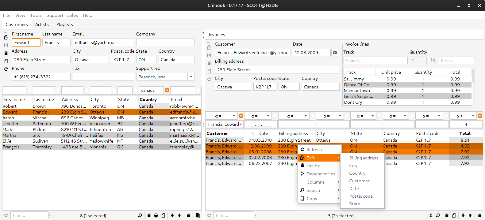

= Codion Application Framework

image::documentation/src/docs/asciidoc/images/codion-logo.png[Codion logo,350]
image::https://github.com/bjorndarri/codion/workflows/Java%20CI/badge.svg[CI]

== Introduction

Codion is a minimalistic full-stack Java rich client CRUD application framework based solely on https://en.wikipedia.org/wiki/Java_Platform,_Standard_Edition[Java Standard Edition] components.

Some highlights.

* Simple domain modelling in plain Java code (no XML, no annotations).
* Integrated JUnit testing of the domain model.
* A minimal but complete JDBC abstraction layer.
* Wiring together a rich Swing client based on the domain model is very straight forward.
* Clients use either a local JDBC connection or are served by a featherweight RMI/HTTP server.
* Integrated JasperReports support.
* Extremely rapid prototyping.
* Excellent replacement for legacy https://en.wikipedia.org/wiki/Oracle_Forms[Oracle Forms] applications.

== Motivation

I started developing Codion back in 2004, when the only Swing rich client CRUD framework available was practically unusable, and I was not about to abandon my good friend Swing in favor of my sworn enemy, HTML, which was fast becoming (to my astonishment) all the rage in the world of CRUD applications. I've been developing and using Codion professionally for the last ($currentYear-2004) years, always with the aim of eventually open sourcing it.

== Framework or library?

Both actually. Codion is highly modular, so you can use as much or as little as you want.

== License

Codion is dual-licensed under the Open Source https://en.wikipedia.org/wiki/Affero_General_Public_License[AGPLv3] license and a commercial license.

Keep in mind that you can freely use the AGPL licensed version to create closed-source applications for personal or internal company use, since it only kicks in when the application is distributed.

See http://www.gnu.org/licenses/gpl-faq.html#GPLRequireSourcePostedPublic[GPL FAQ]

== Dependencies

Codion uses a very limited set of third-party libraries, a simple CRUD client with local JDBC and RMI connection capabilities pulls in the following dependencies:

* *com.toedter:jcalendar* for date input
* *org.json:json* for persisting client preferences
* *org.slf4j:slf4j-api* for your logging framework of choice
* *JDBC driver*
* *Logging framework*

A simple CRUD client pulls in ~15 Codion modules totalling ~1MB, so the combined weight of the Pet Clinic demo client for example is ~1.3MB (excluding the JDBC driver and logging framework).

== Rich Swing Client

Here is a screenshot of the Chinook demo client (included in the project), a rather typical Codion client. Nothing spectacular here, it's just a Swing client after all.

And here's a https://youtu.be/HeZocS89QkE[~1 min. video demonstrating some basic client functionality] (keep your music on, it's silent).

== Domain model

[cols="2,4"]
|===
|Module|Artifact
|is.codion.framework.domain|is.codion.jdk11:codion-framework-domain:{version}
|===

Codion is not an https://en.wikipedia.org/wiki/Object-relational_mapping[ORM] based framework, instead the domain model is based on concepts from entity relationship diagrams, *entities* and *properties*. This simplifies a lot of things and completely eliminates the problems associated with https://en.wikipedia.org/wiki/Object-relational_impedance_mismatch[object-relational impedance mismatch].

In the following example we start by extending the *Domain* class, with three convenient static imports (omitting the rest of the imports for brevity). We then define *EntityType* constants for the entities and use those to create *Attribute* constants for their respective properties. These constants are used whenever we need to refer to the entity type and its values. Finally we use these *entityTypes* and *attributes* to define and configure two entities, with a master-detail relationship.

[source,java]
----
import static is.codion.framework.domain.entity.Entities.type;
import static is.codion.framework.domain.entity.KeyGenerators.automatic;
import static is.codion.framework.domain.property.Properties.*;

public class Store extends Domain {

  public interface Customer {
    EntityType TYPE = type("store.customer");
    Attribute<Integer> ID = TYPE.integerAttribute("id");
    Attribute<String> FIRST_NAME = TYPE.stringAttribute("first_name");
    Attribute<String> LAST_NAME = TYPE.stringAttribute("last_name");
    Attribute<String> EMAIL = TYPE.stringAttribute("email");
    Attribute<Boolean> IS_ACTIVE = TYPE.booleanAttribute("is_active");
  }

  public interface Address {
    EntityType TYPE = type("store.address");
    Attribute<Integer> ID = TYPE.integerAttribute("id");
    Attribute<Integer> CUSTOMER_ID = TYPE.integerAttribute("customer_id");
    Attribute<Entity> CUSTOMER_FK = TYPE.entityAttribute("customer_fk");
    Attribute<String> STREET = TYPE.stringAttribute("street");
    Attribute<String> CITY = TYPE.stringAttribute("city");
  }

  public Store() {
    define(Customer.TYPE,
            primaryKeyProperty(Customer.ID),
            columnProperty(Customer.FIRST_NAME, "First name")
                    .nullable(false).maximumLength(40),
            columnProperty(Customer.LAST_NAME, "Last name")
                    .nullable(false).maximumLength(40),
            columnProperty(Customer.EMAIL, "Email")
                    .maximumLength(100),
            columnProperty(Customer.IS_ACTIVE, "Is active")
                    .defaultValue(true))
            .keyGenerator(automatic("store.customer"))
            .stringProvider(new StringProvider(Customer.LAST_NAME)
                    .addText(", ").addValue(Customer.FIRST_NAME))
            .caption("Customer");

    define(Address.TYPE,
            primaryKeyProperty(Address.ID),
            foreignKeyProperty(Address.CUSTOMER_FK, "Customer", Customer.TYPE,
                    columnProperty(Address.CUSTOMER_ID))
                    .nullable(false),
            columnProperty(Address.STREET, "Street")
                    .nullable(false).maximumLength(100),
            columnProperty(Address.CITY, "City")
                    .nullable(false).maximumLength(50))
            .keyGenerator(automatic("store.address"))
            .stringProvider(new StringProvider(Address.STREET)
                    .addText(", ").addValue(Address.CITY))
            .caption("Address");
  }
}
----

== Domain model test

[cols="2,4"]
|===
|Module|Artifact
|is.codion.framework.domain.test|is.codion.jdk11:codion-framework-domain-test:{version}
|===

The *EntityTestUnit* class provides a JUnit testing harness for the domain model. The *EntityTestUnit.test(entityType)* method runs insert, select, update and delete on a randomly generated entity instance, verifying the results.

[source,java]
----
public class StoreTest extends EntityTestUnit {

  public StoreTest() {
    super(Store.class.getName());
  }

  @Test
  void customer() throws Exception {
    test(Customer.TYPE);
  }

  @Test
  void address() throws Exception {
    test(Address.TYPE);
  }
}
----

== User interface

[cols="2,4"]
|===
|Module|Artifact
|is.codion.swing.framework.ui|is.codion.jdk11:codion-swing-framework-ui:{version}
|===

In the following example, we use the domain model from above and implement a *CustomerEditPanel* and *AddressEditPanel* by extending *EntityEditPanel*. These edit panels, as the name suggests, provide the UI for editing entity instances. In the *main* method we use these building blocks to assemble and display a client.

[source,java]
----
public class StoreDemo {

  private static class CustomerEditPanel extends EntityEditPanel {

    private CustomerEditPanel(SwingEntityEditModel editModel) {
      super(editModel);
    }

    @Override
    protected void initializeUI() {
      setInitialFocusAttribute(Customer.FIRST_NAME);
      createTextField(Customer.FIRST_NAME).setColumns(12);
      createTextField(Customer.LAST_NAME).setColumns(12);
      createTextField(Customer.EMAIL).setColumns(12);
      createCheckBox(Customer.IS_ACTIVE, null, IncludeCaption.NO);
      setLayout(gridLayout(2, 2));
      addPropertyPanel(Customer.FIRST_NAME);
      addPropertyPanel(Customer.LAST_NAME);
      addPropertyPanel(Customer.EMAIL);
      addPropertyPanel(Customer.IS_ACTIVE);
    }
  }

  private static class AddressEditPanel extends EntityEditPanel {

    private AddressEditPanel(SwingEntityEditModel addressEditModel) {
      super(addressEditModel);
    }

    @Override
    protected void initializeUI() {
      setInitialFocusAttribute(Address.STREET);
      createForeignKeyComboBox(Address.CUSTOMER_FK);
      createTextField(Address.STREET).setColumns(12);
      createTextField(Address.CITY).setColumns(12);
      setLayout(gridLayout(3, 1));
      addPropertyPanel(Address.CUSTOMER_FK);
      addPropertyPanel(Address.STREET);
      addPropertyPanel(Address.CITY);
    }
  }

  public static void main(String[] args) {
    Database database = new H2DatabaseProvider()
            .createDatabase("jdbc:h2:mem:h2db",
                    "src/main/sql/create_schema_minimal.sql");

    EntityConnectionProvider connectionProvider =
            new LocalEntityConnectionProvider(database)
                    .setDomainClassName(Store.class.getName())
                    .setUser(Users.parseUser("scott:tiger"));

    SwingEntityModel customerModel =
            new SwingEntityModel(Customer.TYPE, connectionProvider);
    SwingEntityModel addressModel =
            new SwingEntityModel(Address.TYPE, connectionProvider);
    customerModel.addDetailModel(addressModel);

    EntityPanel customerPanel =
            new EntityPanel(customerModel,
                    new CustomerEditPanel(customerModel.getEditModel()));
    EntityPanel addressPanel =
            new EntityPanel(addressModel,
                    new AddressEditPanel(addressModel.getEditModel()));
    customerPanel.addDetailPanel(addressPanel);

    customerPanel.getTablePanel().setConditionPanelVisible(true);
    customerPanel.getTablePanel().getTable().setAutoResizeMode(AUTO_RESIZE_ALL_COLUMNS);
    addressPanel.getTablePanel().getTable().setAutoResizeMode(AUTO_RESIZE_ALL_COLUMNS);

    customerModel.refresh();
    customerPanel.initializePanel();

    Dialogs.displayInDialog(null, customerPanel, "Customers");

    connectionProvider.disconnect();
  }
}
----

...and the result, all in all around 150 lines of code.

image::documentation/src/docs/asciidoc/images/customers.png[align="center"]

== Database access

[cols="2,4,2"]
|===
|Module|Artifact|Description
|is.codion.framework.db.core|is.codion.jdk11:codion-framework-db-core:{version}|Core
|is.codion.framework.db.local|is.codion.jdk11:codion-framework-db-local:{version}|JDBC
|is.codion.framework.db.rmi|is.codion.jdk11:codion-framework-db-rmi:{version}|RMI
|is.codion.framework.db.http|is.codion.jdk11:codion-framework-db-http:{version}|HTTP
|===

The *EntityConnection* interface defines the database layer. There are three implementations available; local, which is based on a direct JDBC connection (used below), RMI and HTTP which are both served by the Codion Server.

[source,java]
----
Database database = new H2DatabaseFactory()
        .createDatabase("jdbc:h2:mem:store",
                "src/main/sql/create_schema_minimal.sql");

EntityConnectionProvider connectionProvider =
        new LocalEntityConnectionProvider(database)
                .setDomainClassName(Store.class.getName())
                .setUser(Users.parseUser("scott:tiger"));

EntityConnection connection = connectionProvider.getConnection();

List<Entity> customersNamedDoe =
        connection.select(Customer.TYPE, Customer.LAST_NAME, "Doe");

List<Entity> doesAddresses =
        connection.select(Address.TYPE, Address.CUSTOMER_FK, customersNamedDoe);

List<Entity> customersWithoutEmail =
        connection.select(selectCondition(Customer.TYPE, Customer.EMAIL, Operator.LIKE, null));

//The domain model entities, a factory for Entity instances.
Entities entities = connection.getEntities();

Entity customer = entities.entity(Customer.TYPE);
customer.put(Customer.FIRST_NAME, "Peter");
customer.put(Customer.LAST_NAME, "Jackson");

Entity.Key customerKey = connection.insert(customer);
//select to get generated and default column values
customer = connection.selectSingle(customerKey);

Entity address = entities.entity(Address.TYPE);
address.put(Address.CUSTOMER_FK, customer);
address.put(Address.STREET, "Elm st.");
address.put(Address.CITY, "Boston");

Entity.Key addressKey = connection.insert(address);

customer.put(Customer.EMAIL, "mail@email.com");

customer = connection.update(customer);

connection.delete(asList(addressKey, customerKey));

connection.disconnect();
----

Continue exploring on the link:https://codion.is[Codion Web Site].